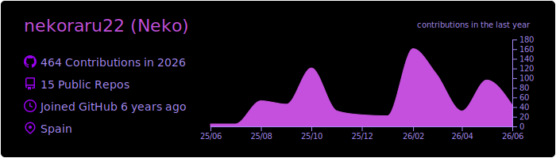
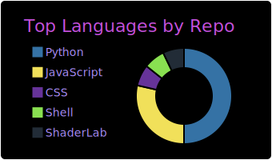
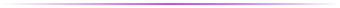
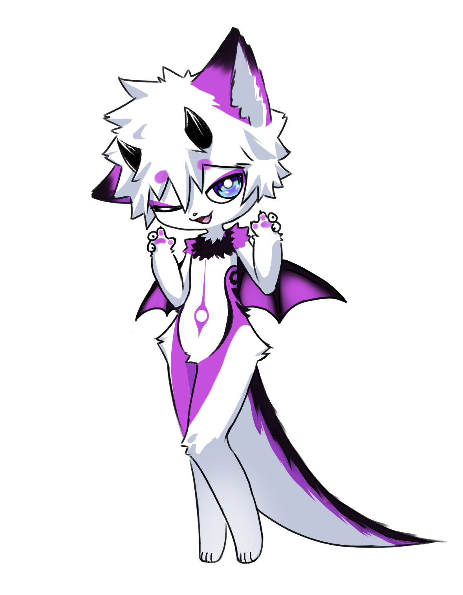

<h3 align="center">Connect with me</h3>

 <strong>nekoraru22</strong>
&nbsp;&nbsp;|&nbsp;&nbsp;
 <a href="https://matrix.to/#/@neko:nekoraru.me" target="_blank">@neko:nekoraru.me</a>

<h3 align="center">Statistics &nbsp; </h3>
<table align="center" border="0" cellspacing="8" cellpadding="0">
  <tr>
    <td valign="middle"></td>
    <td valign="middle"></td>
  </tr>
</table>

<table align="center" border="0" cellspacing="8" cellpadding="0">
  <tr>
    <td valign="top"></td>
    <td valign="top" align="center">
      
       
      
       
      
       
      
    </td>
  </tr>
</table>

<h4 align="center">Visit Counter</h4>

  

